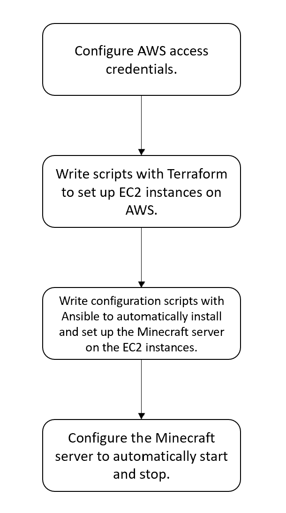

# Background: What will we do? How will we do it? 

In this project, we will use Infrastructure as Code (IaC) tools and principles to automate the configuration and deployment of a Minecraft server on AWS. The general process is as follows: first, we will use Terraform to write infrastructure configuration scripts to automatically create and configure AWS resources such as EC2 instances, network components (VPC, subnets, security groups). Then, we will use Ansible to write configuration scripts to automate the installation and setup of the Minecraft server software on the configured EC2 instances, as well as enable the Minecraft server to restart automatically.

# Requirements:

## What will the user need to configure to run the pipeline?

The user needs to have an AWS account and configure the AWS CLI .

## What tools should be installed?

The user needs to install three things:

1. Install the Terraform CLI
   
   Tutorial: https://developer.hashicorp.com/terraform/tutorials/aws-get-started/install-cli

2. Install the AWS CLI
    
    Tutorial: https://docs.aws.amazon.com/cli/latest/userguide/getting-started-install.html

3. Ansible
   
    You can install Ansible by following these steps:

    - On macOS, you can use Homebrew:
    
    ```bash
    brew install ansible
    ```

    - On Linux, you can use pip:

    ```bash
    pip install ansible
    ```

## Are there any credentials or CLI required?

Users will have to set-up their AWS credentials for Terraform to work. 

Tutorial:

1. Start your AWS Academy Learner Lab.
2. Click on "AWS Details" in the top right corner of your Learner Lab page.
   
3. Create the file `~/.aws/credentials` and copy the credentials from `Cloud Access - AWS CLI`. The format of the credentials is as follows:
   
   ```
    [default]
    aws_access_key_id=XXXX....
    aws_secret_access_key=XXXXX....
    aws_session_token=XXXX...
    ```

   Save the file.

## Should the user set environment variables or configure anything?

Just need to set up the above configurations.

# Diagram of the major steps in the pipeline. 



# List of commands to run, with explanations.

1. Use Git to clone the repo:

```bash
git clone https://github.com/Liu-Shengsheng/CS312-Project-Part2.git
```

2. Then go to the directory.
   
```bash
cd CS312-Project-Part2/
```

3. run `terraform init`, then input `yes` if required.

4. run `terraform fmt` and `terraform validate` to ensure Terraform configuration files are well-formed and syntactically correct.

5. run `terraform apply`. Type `yes` if required.

6. If everything is correct, you will see this output: `Apply complete! Resources: 4 added, 0 changed, 0 destroyed.`
   
7. run `cat server_public_ip.txt`, then remember the obtained public IP address.
   
8. To use Ansible to install and configure the Minecraft server on the instance, run `ansible-playbook -i ./inventory.yml ./playbook.yml`. Since Ansible uses SSH to connect to the newly created instance's public IP address, you may need to enter `yes` to confirm the connection.

9.  Then wait about one minute for the server to startup, then run `nmap -sV -Pn -p T:25565 {your public ip address}`.

10. If you see an output similar to the following, it means the server has started successfully. 

```
Starting Nmap 7.92 ( https://nmap.org ) at 2024-06-04 22:19 PDT
Nmap scan report for ec2-35-85-46-106.us-west-2.compute.amazonaws.com (35.85.46.106)
Host is up (0.019s latency).

PORT      STATE SERVICE   VERSION
25565/tcp open  minecraft Minecraft 1.19.4 (Protocol: 127, Message: A Minecraft Server, Users: 0/20)

Service detection performed. Please report any incorrect results at https://nmap.org/submit/ .
Nmap done: 1 IP address (1 host up) scanned in 6.85 seconds
```

11. run `ansible-playbook -i inventory.yml reboot_instance.yml` to reboot the instance, wait until the script finishes running, then use the `nmap` command above again. If the Minecraft version information can still be detected, it means the automatic restart service configuration is successful.


## How to connect to the Minecraft server once it's running?

See the instruction #9 above.